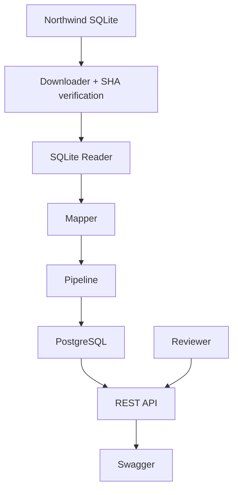

# System Architecture

## Overview

The system ingests data from a fixed Northwind SQLite source and transforms it into a canonical domain model through a staged processing pipeline.

The original SQLite database is treated as immutable.

The application never modifies the downloaded source file.

Instead:

1. Download source
2. Verify SHA256
3. Read source
4. Execute processing pipeline
5. Persist canonical data
6. Serve processed data through REST APIs

---

## Technology Stack

| Component | Technology |
|---|---|
| Language | TypeScript |
| Runtime | Node.js |
| Web Framework | Express |
| Database | PostgreSQL |
| ORM | Prisma |
| Validation | Zod |
| Logging | Pino |
| API Docs | Swagger/OpenAPI |
| Testing | Jest + Supertest |
| Containerization | Docker Compose |

---

## High-Level Architecture



---

## Pipeline Design

The application executes explicit stages:

```text
ingest
→ validate
→ normalize
→ dedupe
→ consistency-check
→ persist
→ serve/query
```

Each stage has a single responsibility.

---

### Ingest

Responsibilities:

- Read Northwind tables
- Join Orders and OrderDetails
- Convert to canonical structures

Output:

Canonical Order objects

---

### Validate

Responsibilities:

- Required fields
- Type validation
- Range validation

Examples:

- negative quantities
- invalid dates
- missing identifiers

---

### Normalize

Responsibilities:

- Date normalization
- total calculations
- discount normalization
- fingerprint generation

---

### Dedupe

Responsibilities:

Detect:

- exact duplicates (skipped, registered in the table PipelineRun)
- possible duplicate candidates (registered with with a related exception)

This stage reads existing database content to guarantee idempotency.

---

### Consistency Check

Business rules:

1. Order total equals sum(lines)+freight

2. Discount ranges remain valid

3. Duplicate detection using fingerprints and time window

4. Shipping and order date consistency

Detected issues become ProcessingExceptions.

---

### Persist

Stores:

- orders
- order lines
- exceptions
- pipeline run information

No writes occur before this stage.

---

### Serve / Query

REST endpoints allow reviewers to:

- inspect orders
- inspect exceptions
- trigger re-ingestion
- verify idempotency

---

## Repository Structure

```text
src/

api/
domain/
ingestion/
persistence/
common/
tests/
```

---

## Logging

Structured JSON logging is implemented through Pino.

Each pipeline execution generates:

- correlationId
- stage
- timestamps
- execution metadata

Example:

```json
{
  "correlationId":"abc-123",
  "stage":"NORMALIZE",
  "message":"Generated fingerprint"
}
```

---

## Authentication

The API uses simple API-key authentication:

Header:

X-API-KEY

This mechanism intentionally remains lightweight because the challenge does not require user management or OAuth flows.

---

## Design Assumptions

- Northwind source remains immutable
- SQLite acts only as input
- PostgreSQL stores canonical data
- Duplicate prevention uses fingerprints
- Order-level exceptions aggregate line problems