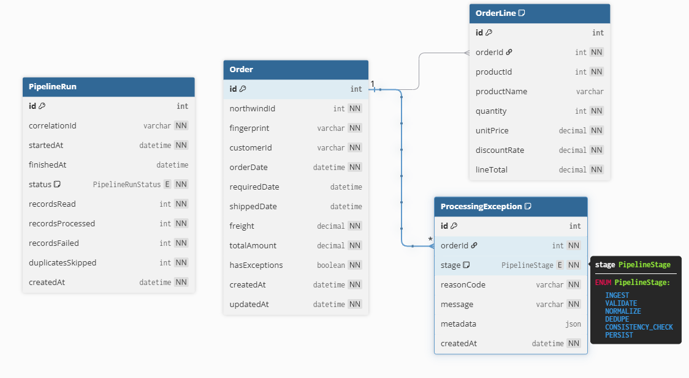

# Database Design

## Overview

The system does not replicate the original Northwind schema. Instead, it defines a strongly typed canonical model focused on business processing requirements.

The source SQLite database acts only as a read-only data provider. Orders and order details are transformed into a simplified domain model designed for:

- Idempotent ingestion
- Data validation
- Exception tracking
- Business consistency rules
- Queryability through REST APIs

The model centers around four entities:

- Order
- OrderLine
- ProcessingException
- PipelineRun

The information about customers, employees, shipping, etc will not be used.
---

## Entity Relationship Diagram



---

## Order

Represents a canonical business order extracted from Northwind.

Fields:

- `northwindId`: original source identifier
- `fingerprint`: SHA256 hash used for idempotency and duplicate detection
- `customerId`: source customer identifier
- `freight`: shipping cost
- `totalAmount`: calculated order total
- `hasExceptions`: indicates whether anomalies were detected

Relationships:

- One Order → Many OrderLines
- One Order → Many ProcessingExceptions

Indexes:

- customerId
- orderDate
- customerId + orderDate

---

## OrderLine

Represents a product entry inside an order.

Each line stores:

- product information
- quantity
- unit price
- discount
- calculated line total

Relationship:

Many OrderLines → One Order

---

## ProcessingException

Stores anomalies discovered during pipeline execution.

Examples:

- invalid dates
- inconsistent totals
- invalid discount values
- duplicate suspicion

Flexible metadata is stored as JSON:

```json
{
   "expectedTotal":100,
   "calculatedTotal":112
}
```

This design allows new validation rules without schema changes.

---

## PipelineRun

Stores execution history for ingestion runs.

Tracks:

- records read
- records processed
- failed records
- duplicates skipped
- execution status
- correlation id

This entity supports observability and auditability.

---

## Design Decisions

### Canonical model instead of full replication

The original Northwind database contains many unrelated entities:

- Employees
- Territories
- Suppliers
- Categories

The challenge requires a strong Order/Line domain model rather than copying the operational schema.

Only data required for processing logic is imported.

---

### Exception storage strategy

Exceptions are attached at Order level.

Line-level problems are propagated upward to the parent order.

This enables reviewers to inspect problematic orders directly without navigating child entities.

The obviously duplicated information (detected thanks to the fingerprint of the order table) is omitted, 
and that cases are storaged in the PipelineRun table


---

### Flexible exception reason codes

Reason codes are stored as strings rather than database enums.

This allows future business rules to be added without requiring schema migrations.